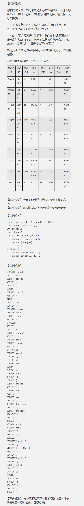
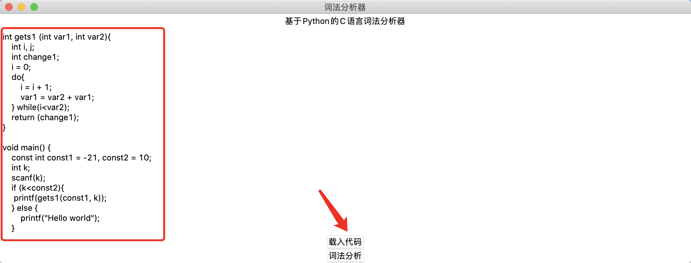
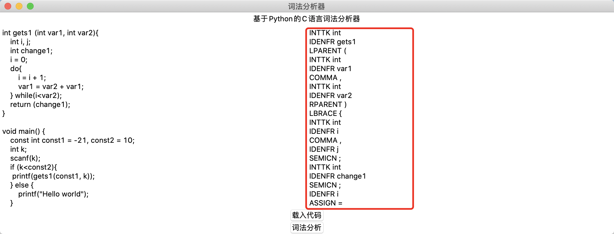
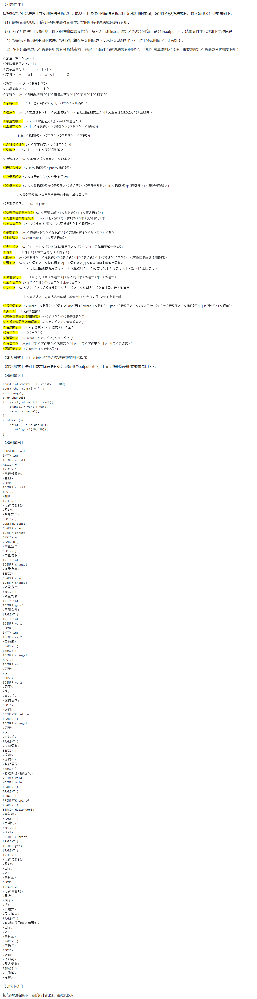

# bistu_compile_principle

BISTU 编译原理课程的两次实验代码。

## 词法分析

### 程序要求

在 `parser/lexical_analyzer/analyse_c.py` 文件中实现了词法分析器。并提供了用户操作界面。

### 程序实现

操作步骤：

1. 在调用 `tk()` 方法，即可完成界面的初始化启动。程序启动后界面如下：

2. 之后点击 `载入代码` 按钮，将文件载入到词法分析器中，代码载入成功后会在界面的左侧出现代码的内容。效果图如下：

3. 点击 `词法分析` 按钮可以启动词法分析器，分析结果会展示在界面的右侧部分。效果图如下：

> 调用程序中的 simple()方法可以不启动 GUI 界面。默认是使用 testfile.txt 进行测试，更多的测试代码放在 `testfiles` 文件夹下面。

## 语法分析

### 程序要求

### 程序实现

程序的具体实现代码在 `parser/parser_c.py` 中。在实现语法分析的时候，调用了词法分析器来完成相应的功能（主要是获取分词）。

> 默认是使用 testfile.txt 进行测试，更多的测试代码放在 `testfiles` 文件夹下面。
